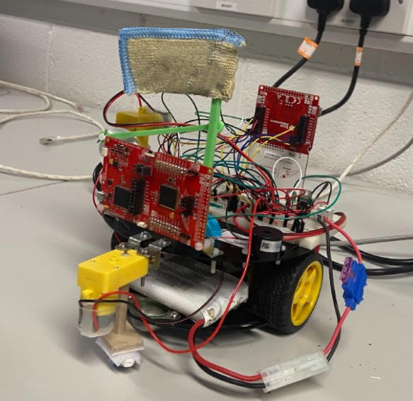
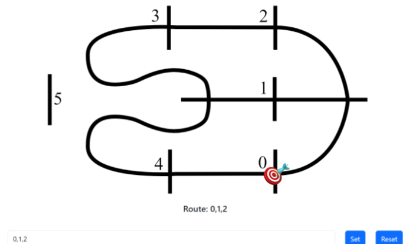
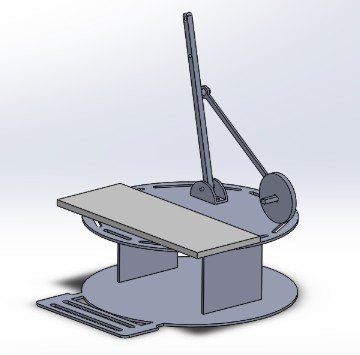

# 🤖 Autonomous Navigation Robot – Group Project

A fully autonomous mobile robot designed to follow a white line and communicate with a cloud server over WiFi. Built using dual MSP432 microcontrollers, this robot was developed as a third-year group project in Mechatronic Engineering. The system integrates line-following logic, WiFi-based position updates, and unique physical innovations including a waving flag and sweeping brush for a road sweeper themed design.

## 🔧 Features

- MSP432-based control architecture
- 5-sensor line follower board for autonomous navigation
- WiFi server integration via CC3100 boosterpack
- Real-time position exchange with cloud server
- Precision routing across predefined paths
- 180° U-turn and directional calibration functions
- Hardware-triggered flag waver & cleaning brush system
- Final parking maneuver using a Sharp distance sensor and buzzer feedback

## ⚙️ Technologies Used

- **Microcontrollers**: MSP432 LaunchPad x2  
- **Communication**: CC3100 WiFi Boosterpack  
- **Programming**: Energia (Arduino-based C)  
- **Sensors**: IR Line Follower Array, Sharp GP2YOA41SK0F Distance Sensor  
- **Innovation Hardware**: 3D printed waving flag system, sweeping brush, buzzer  
- **Design Tools**: SolidWorks (3D printed features), Serial Monitor (sensor calibration)  

## 📸 Media

### 📷 Mobot Build

### 💻 Online Server to Set Route

### 🛠️ Flag Waving Mechanism (CAD)

### 🎥 Demo Video  
📽️ [Watch Demo (Download)](Autonomous_Navigating_Robot_Video.mov)

## 💻 Source Code

🔗 [View `mobot_code.cpp`](mobot_code.cpp)

## 🧠 Core Functionality

1. **Line Following**  
   - Reads from 5 IR sensors.
   - Implements a calibrated truth table and logic to steer, turn, and halt at junctions.

2. **WiFi Communication**  
   - Sends current position to a cloud server.
   - Receives next target and updates position.
   - Handles server latency and routing logic.

3. **Routing & Steering**  
   - Full routing map logic defined for all node pairs (0–5).
   - 90° and 180° turns calibrated via delay tuning.
   - “Steer()” function manages real-time path tracking.

4. **Innovation Features**  
   - Flag waving on junction detection (driven by 2nd MSP432).
   - Sweeping brush powered by an independent motor & bracket.
   - Distance sensor + buzzer for precise parking functionality.

## 💡 What We Learned
- Multi-microcontroller coordination
- Sensor signal noise filtering and debouncing
- Embedded WiFi integration and server syncing
- Real-world debugging: grounding issues, shadow variables, timing bugs
- CAD & prototyping for custom moving parts
- Real-time feedback loop design

.

**Ivan McCauley** – Mechatronic Engineering Graduate  
[LinkedIn](https://www.linkedin.com/in/ivan-mccauley-82b17a177)
